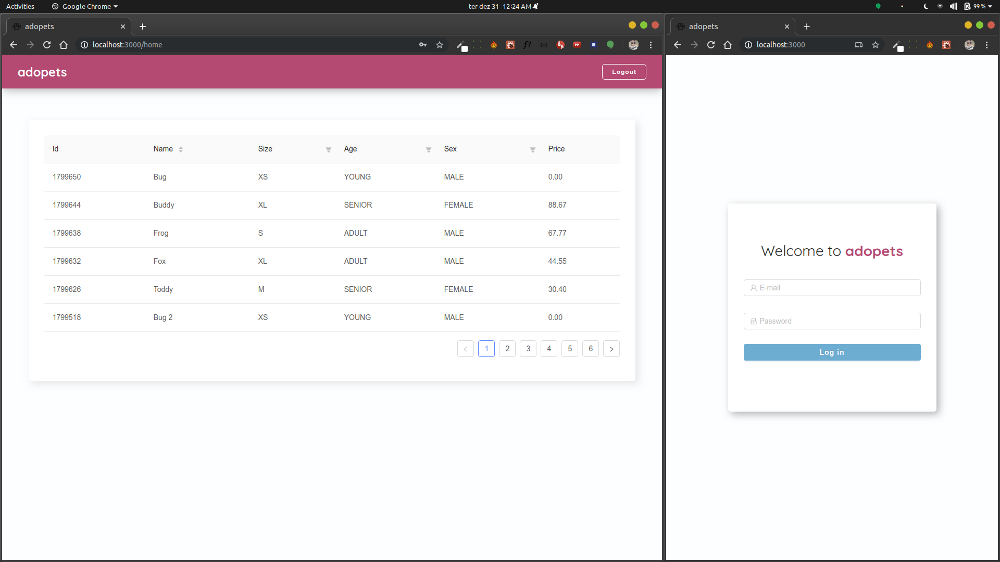

<h1 align="center">
 
  
 
 
TEST FRONTEND - ADOPETS
</h1>

This was Adopets's test project to consume a dog API.

  

## Features

[//]: # "Add the features of your project here:"

- ⚛️ **React Js** — A JavaScript library for building user interfaces

## Getting started

In Building...

## License

This project is licensed under the MIT License - see the [LICENSE](https://opensource.org/licenses/MIT) page for details.
